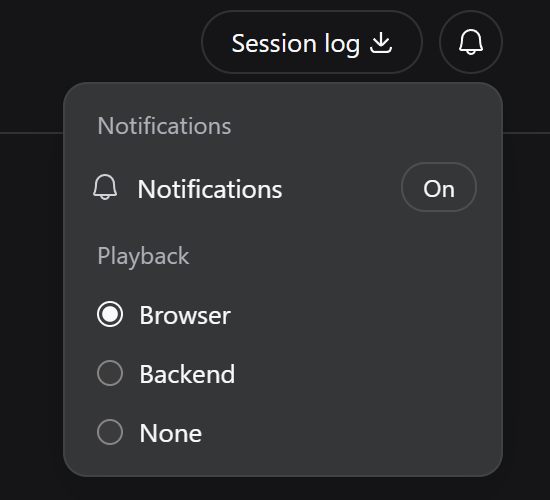

# dsh-notify-bell

[English](./README.md) | [中文](./README.zh.md) | [Changelog](./CHANGELOG.md)

[](https://www.npmjs.com/package/dsh-notify-bell) [](https://github.com/ZYar-er/dsh-notify-bell/releases/latest)

<p align="center">
  
</p>

A **community plugin** for [DeepSeek Harness (DSH)](https://github.com/deepseek-ai/deepseek-harness) that provides semantic notification sounds for important agent events.

> **Developer Preview · v0.12.0**

🎧 **[Listen to the notification sounds →](https://zyar-er.github.io/dsh-notify-bell/sound-showcase/)**

dsh-notify-bell lets you step away from the DSH Web UI without missing important agent events.

Instead of notifying on every internal event, it focuses on moments when the agent actually needs your attention:

* ✓ **Complete** — the agent finished its final answer
* 🔐 **Approval** — a tool operation needs your approval
* ❓ **Question** — the agent is waiting for an answer
* ⚠ **Blocked** — the goal cannot continue
* ✗ **Error** — the agent encountered an agent-level error

Each event has its own semantic sound rather than relying on repeated beeps to communicate meaning.

## Features

* Semantic notifications for complete, approval, question, block, and error events
* Browser playback in DSH Web
* Host-side playback on Windows, WSL, and Linux
* One-click mute/unmute from the DSH Web UI
* Playback selector: **Browser / Backend / None**
* Light/dark theme support
* Phosphor `bell` / `bell-slash` notification button
* WAV sound pack
* BEL fallback for backend playback
* Configurable notification sounds
* Configurable minimum duration for completion notifications
* Official DSH Cordis plugin format with schema validation
* No runtime dependencies beyond the official `@deepseek-ai/schemastery`

## Installation

Install from npm:

```bash
dsh plugin --profile web add dsh-notify-bell
```

After installation, restart `dsh web` if required by your current DSH setup.

### From source / GitHub

From a checkout of this repository:

```bash
dsh plugin --profile web add ./dsh-notify-bell
```

For development versions or source testing, install straight from GitHub:

```bash
dsh plugin --profile web add github:zyar-er/dsh-notify-bell#<commit-sha>
```

Pinning a commit is recommended when installing directly from GitHub.

## Quick Start

After starting DSH Web, a notification bell appears next to **Session log**:

```text
Session log   🔔
```

Click the bell to open notification settings.



You can control:

* **Notifications** — enable or disable all notification sounds
* **Playback** — choose where sounds are played:

  * **Browser**
  * **Backend**
  * **None**

Changes apply immediately and are persisted automatically.

## Playback Modes

### Browser

Recommended for DSH Web.

The backend classifies notification events and sends semantic sound events to the browser over SSE. The browser plays the bundled WAV files using Web Audio.

```text
DSH backend
   ↓
SSE
   ↓
DSH Web
   ↓
Web Audio
   ↓
WAV
```

Browser playback requires normal user interaction with the page before the first sound because of browser autoplay policies.

Once unlocked, the DSH tab can remain in the background while you work in another tab.

Browser playback does **not** use the browser Notification API and does not require notification permissions.

### Backend

Playback happens on the host instead of inside the browser.

On Windows and WSL:

```text
PowerShell
  → System.Media.SoundPlayer
  → Windows Audio
```

On Linux, the plugin probes available players in this order:

```text
paplay
pw-play
aplay
ffplay
```

If WAV playback is unavailable, backend playback can fall back to the terminal BEL when a TTY is available.

### None

Notifications are logged but no sound is played.

### Selecting a playback mode

The playback mode can be changed from the notification settings popover without restarting DSH.

Configuration:

```json
{
  "playback": "browser"
}
```

Allowed values:

```text
browser
backend
none
```

There is currently no automatic Browser → Backend fallback and no `both` mode. The selected mode is intentional: one notification is handled by one playback backend.

## Notification Sounds

| Event       | Sound                       | Source       | Duration |
| ----------- | --------------------------- | ------------ | -------: |
| ✓ Complete  | `ui/success_bling`          | react-sounds |    0.76s |
| 🔐 Approval | `notification/notification` | react-sounds |    0.86s |
| ❓ Question  | `notification/info`         | react-sounds |    0.86s |
| ⚠ Blocked   | `ui/blocked`                | react-sounds |    0.89s |
| ✗ Error     | `notification/error`        | react-sounds |    0.55s |

🎧 **[Listen to all sounds](https://zyar-er.github.io/dsh-notify-bell/sound-showcase/)**

Each notification uses a distinct sound identity rather than counting repeated beeps.

## Configuration

The plugin follows the official DSH Cordis configuration model and exports
a Schemastery `Config` schema: the `config` block of the plugin row in your
profile's `cordis.patch.yml` is validated and default-filled at load time,
and invalid values fail loudly.

Example (profile patch):

```yaml
- id: notify-bell
  config:
    minDuration: 10
    playback: backend
```

The legacy runtime-state file is:

```text
~/.config/dsh/notify-bell.json
```

Its path can be overridden with:

```text
DSH_NOTIFY_BELL_CONFIG
```

The Web UI persists `enabled` and `playback` there. Example file:

```json
{
  "enabled": true,
  "minDuration": 10,
  "objective": {
    "maxLength": 120
  },
  "events": {
    "complete": {
      "enabled": true,
      "sound": "done"
    },
    "block": {
      "enabled": true,
      "sound": "block"
    },
    "approval": {
      "enabled": true,
      "sound": "permission"
    },
    "question": {
      "enabled": true,
      "sound": "question"
    },
    "error": {
      "enabled": true,
      "sound": "error"
    }
  },
  "soundPack": "wav",
  "playback": "browser",
  "wav": {
    "directory": "~/.config/dsh/notify-bell/sounds",
    "fallback": "bell"
  },
  "bell": {
    "gapMs": 150,
    "permissionGapMs": 300
  }
}
```

### Completion threshold

Tasks shorter than `minDuration` do not play the completion sound.

Approval and question notifications are immediate because they indicate that the agent is waiting for the user.

### Runtime mute

`enabled` controls all notification playback.

When disabled:

* no browser sound is sent
* no backend sound is played
* DSH continues running normally
* other configuration is preserved
* no restart is required

### Configuration sources

The plugin follows the official DSH Cordis configuration model.

Explicit plugin configuration takes precedence over the legacy runtime-state file:

```text
cordis config  >  notify-bell.json  >  schema defaults
```

For normal users, the Web UI is the easiest way to change notification state and playback mode.

## Event Behavior

### Complete

A completion notification means that the agent has finished its final answer for the current turn.

The notification is based on:

```text
session/event
type = turn/end
data.reason.kind = completed
```

The turn must contain a real final assistant text response. Empty no-op turns and tool-call-only `concludesTurn` endings do not trigger the completion sound.

Subagent turns are ignored.

Completion duration is measured from:

```text
turn/start.time → turn/end.time
```

Requests shorter than `minDuration` are logged but do not play the completion sound.

### Approval

Triggered by:

```text
approval/asked
```

This means a tool operation is waiting for user approval.

`approval/decided` does not produce another notification.

### Question

Triggered when the agent invokes:

```text
ask_user_question
```

The notification indicates that the agent is waiting for a user response.

The response itself does not create another notification.

### Blocked

Triggered by:

```text
goal/changed
operation = block
```

### Error

Triggered by:

```text
agent/error
```

This represents an agent-level error. A normal shell command returning a non-zero exit code does not necessarily produce this event.

## Platform Support

### Windows / WSL

Browser playback is recommended when using DSH Web.

Backend playback uses:

```text
PowerShell
  → System.Media.SoundPlayer
  → Windows Audio
```

### Linux

Backend playback automatically probes:

```text
paplay
pw-play
aplay
ffplay
```

No additional player is installed automatically.

## Developer Documentation

The following sections are primarily for contributors and plugin developers.

### Official DSH Plugin Format

dsh-notify-bell follows the official DSH plugin format.

The package:

* exports a Schemastery `Config` schema
* uses the official Cordis plugin form
* declares its bundle patch through `dsh.bundle`
* provides the Web client through `dsh.client`
* uses `cordis.patch.yml` without requiring manual profile patch editing

The official DSH plugin documentation is available at:

https://deepseek-harness.github.io/deepseek-harness/develop/basic/

### Architecture

```text
DSH session events
        ↓
event classification
        ↓
semantic sound
        ↓
playback
   ┌────┼───────┐
   ↓    ↓       ↓
browser backend none
   ↓      ↓
 SSE    audio
   ↓      ├─ WAV
 Web      └─ BEL fallback
 Audio
```

The event layer is independent from the physical audio backend.

Semantic sounds are:

```text
done
permission
question
block
error
```

### Browser Backend

Browser mode uses:

```text
session event
    ↓
server-side classification
    ↓
SSE: /notify-bell/events
    ↓
client.js
    ↓
Web Audio
    ↓
bundled WAV
```

The browser does not duplicate the event classification logic.

### Backend Audio

Backend mode uses the existing platform audio abstraction:

```text
Windows / WSL
→ PowerShell + SoundPlayer

Linux
→ paplay
→ pw-play
→ aplay
→ ffplay

failure
→ BEL fallback
```

### Web Client

The Web client is loaded using the DSH client module system and registers the notification controls next to Session log.

The notification settings popover controls:

* `enabled`
* `playback`

Runtime state is persisted atomically to the legacy configuration file.

## Testing

The project includes unit and session-layer integration tests.

Current test status:

**All tests passing — 11 `node:test` cases (6 unit + 5 session-layer integration), with 179 assertion checks in the unit script.**

Real-world verification has covered:

* task completion
* approval requests
* user questions
* Web UI mute/unmute
* Browser playback
* background-tab Browser playback
* WSL → Windows WAV playback
* backend playback
* playback mode switching

The error notification path is covered by automated tests; deliberately breaking credentials is not required for normal validation.

## Developer Preview

DSH is still in Developer Preview, so upstream plugin and event APIs may change.

dsh-notify-bell is a community plugin and is not an official DeepSeek plugin.

Community testing is especially welcome for:

* Windows native
* WSL
* Linux audio playback
* Browser playback
* background-tab playback
* approval notifications
* question notifications
* sound loudness and long-term comfort
* configuration compatibility
* DSH upstream changes

When reporting an issue, please include:

* DSH version
* operating system/environment
* playback mode
* notification event
* expected behavior
* actual behavior
* reproduction steps

## Credits

Sound assets are from [react-sounds](https://github.com/e3ntity/react-sounds).

Icons use [Phosphor Icons](https://phosphoricons.com/).

Built for [DeepSeek Harness](https://github.com/deepseek-ai/deepseek-harness).

## License

The dsh-notify-bell source code is licensed under the
[MIT License](./LICENSE).

This repository also distributes third-party sound and icon assets.
See [NOTICE.md](./NOTICE.md) for their respective licenses and attribution.
